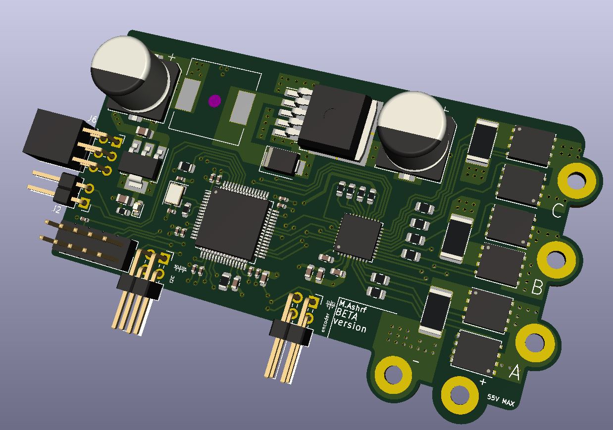
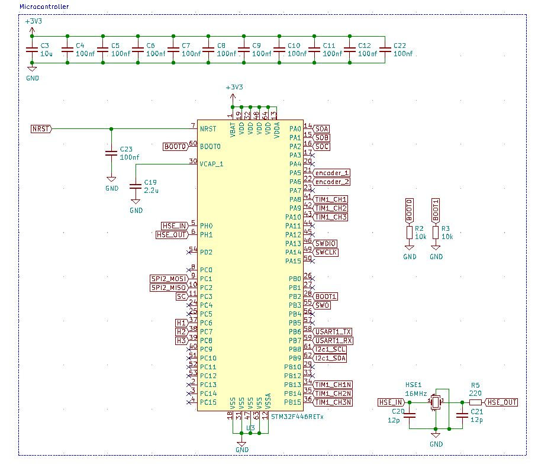
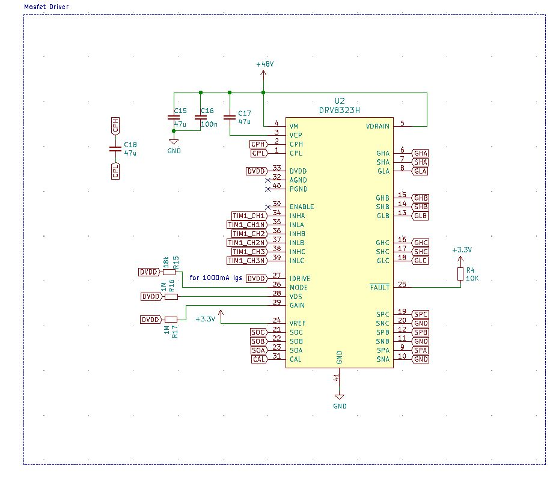
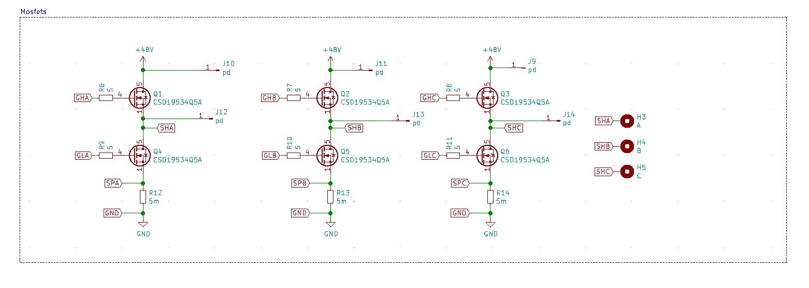
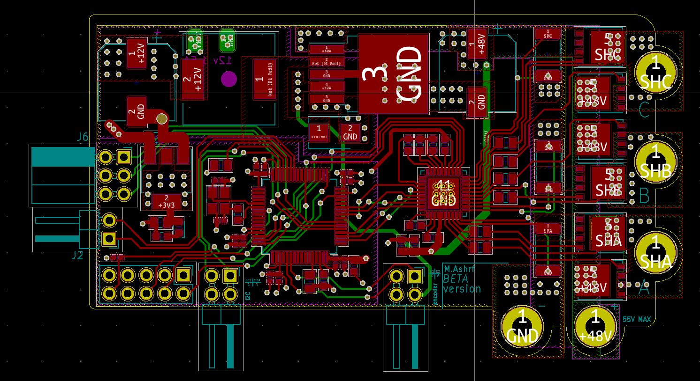

# Iskander
Iskander is an open source driver for low voltage **DC**, **BLDC**, **PMSM** motors, amde specifically for education and learning.
the repo containts some example ocodes and SIMULINK modeles to help you get started.

# Main HARDWARE
- STM32f446RE (main micro-controller)

- DRV8323H (mosfet driver and current sensors)

- CSD19534Q5A (MOSFETs)

# the hardware supports the following drives
### DC motor supported drives
- open/closed loop speed control.
- torque control.
- cascadded control.
- position control.

### BLDC motor supported drives
- open/closed loop sensored speed control (Hall effect sensors)
- sensored cascadded control.

### PMSM motor supported drives
- sensored FOC control.
- sensorless control using MRAS as speed estimator(currently under testig).
- sensorless control using EKF as speed estimator(currently under testig).

# PCB layout

